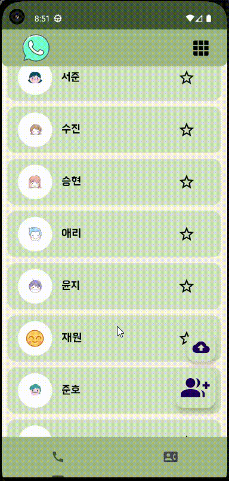
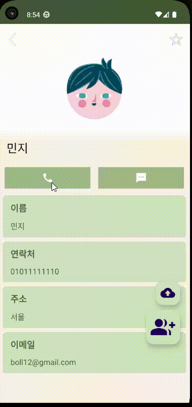
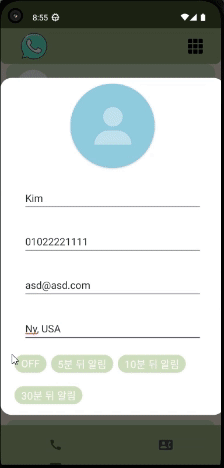
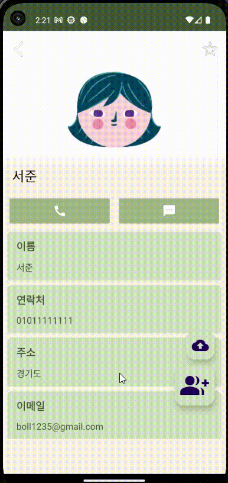

# nbc_contact 
ContactData  
ContactDatabase  
추가 및 drawable 에 사람1~사람11 까지 이미지 아이콘 추가 
glide 대신=> implementation("io.coil-kt:coil:0.10.0")  코일 라이브러리 추가 

# 앱 개발 숙련 주차 팀프로젝트

## 연락처 앱

### 주요 기능 실행 이미지

## Images

  

### 메인페이지

## Images

  

### 디테일페이지

## Images

  

### 마이 페이지

## Images

  

### 다이얼로그 페이지

## Images

  

### 리스트 페이지

## Images

  

##요구사항

### **마이 페이지 (MyPageFragment)**

<aside>
🌟 필수 구성 요소

- **ConstraintLayout**
- **ImageView**
- **Button**
- **ScrollView**
</aside>

- 사용자의 상세 정보를 표시 하도록 구현합니다.
- 사용자의 정보 표시 하도록 구현합니다.

### 📌 **상세 정보 (ContactDetailFragment)**

<aside>
🌟 필수 구성 요소

- ConstraintLayout
- ImageView
- Button
- Bundle
- ScrollView
</aside>

- 연락처의 상세정보를 표시 하도록 구현합니다.
- 연락처 추가 시 입력 받은 값을 표시 하도록 구현합니다.
- 상세 정보를 표시할 때 **`Bundle`**을 이용하여 데이터를 전달합니다.

### 📌 **연락처 추가 (AddContactDialog or AddContactDialogFragment)**

<aside>
🌟 필수 구성 요소

- Dialog 또는 DialogFragment
- EditText
- 기능 버튼
</aside>

- 연락처 추가를 위한 **`Dialog`**를 구현합니다.
- 이름, 전화번호, 사진, 이메일 주소, 이벤트 정보(선택) 등을 입력하도록 구현합니다.
    - 커스텀 가능한 항목
- 입력 필드의 **유효성 검사**를 통해 사용자가 **설정한 조건**에 맞는
  올바른 정보를 입력할 수 있도록 구현합니다.

### 📌 **연락처 리스트 (ContactListFragment)**

<aside>
🌟 필수 구성 요소

- RecyclerView
- Adapter
- ViewHolder
</aside>

- 연락처 목록을 **리스트 형태**로 보여주도록 구현합니다.
- 각 아이템에는 **사진, 이름, 좋아요** 정보가 표시되도록 구현합니다.

### 📌 **TabLayout 과 ViewPager**

<aside>
🌟 필수 구성 요소

- TabLayout
- ViewPager
- ContactListFragment
- MyPageFragment
</aside>

- 탭을 사용하여 여러 **`Fragment`**를 한 화면에서 쉽게 탐색할 수 있게 구현합니다.
- 각 화면을 **`Fragment`**로 구현하고 사용자의 click 혹은 drag에 따라
  다른 화면으로 이동하도록 구현합니다.
- **`ViewPager2`**를 사용하면 더 나은 성능과 기능을 활용할 수 있습니다.

# What to

- 요구 사항에 맞춰 UI 및 기능을 구현했습니다.
- 권한 설정과 안드로이드  버전 처리를 해주었습니다.
- 앱 아이콘 또한 적절하게 변경했습니다.
- 선택 구현 과제를 구현하였습니다.

# How to

### data/ContactDatabase

-더미 데이터는 ContactDatabase를 통해 받아 오게 됩니다.
아이템의 삭제나 업데이트 작업도 해당 Object에서 담당합니다.

-데이터들을 되도록 불변 데이터로 처리할 수 있게끔 deta class Contact 안에 val 로선언 헀습니다.

-이미지값을 coil 라이브러리를 사용하기위해서 uri로 선언해주었습니다.

### util/addCallDialog, util/AlramReciver
-dialog를 확장해서 제작하였고 다이얼로그 성공여부를 onSuccess: () -> Unit로 반환해줍니다.

-알림 설정 시간에 따라서 알림이 뜨는것을 다르게 하기위해서 AlramReciver에서 값을 선언해주고 권한설정은
메인에서 선언해줍니다.

### list/*

-RecyclerView 를 선언해줄 fragment와 adapter를 선언해주고 adapter와 같은 경우에는 ListAdpater와 DiffUtil을
활용해서 구성해주었고  GridLayout을 동시에 적용시켜주기위해서 viewType을 다르게 선언한후  adapter에서 2개의 레이아웃을 사용할수있게 선언해줍니다.

-다른 Fragment 또는 Activity에서 변경되거나 수정된내용을  RecyclerView에서 갱신해주기위해서 갱신 메소드를 선언해줍니다.

-실제 전화나 메세지를 실행 시키는 버튼 이벤트를 생성해서 내부 통화 , 메세지 기능에 접근할수있도록 하였습니다.

### detail/*

-recyclerview item을 click하면 detailfragment로 넘어갈수있도록 MainActivity에 메서드를 따로 선언해주고
getParcelable 버전에따라서 예외처리를 해줍니다.

-받아온 Contact 데이터의 초기 isFavorite 값으로 isfavorite를 초기화한 후, 즐겨찾기 구현 로직에 이용했습니다.
종료하기 전, 이 isfavorite 값이 처음에 받아온 Contact 데이터의 isFavorite 값과 달라졌을 때만 isFavorite = !isFavorite통해 아이템을 업데이트 해주고, recyclerview에 적용되도록 합니다.

### mypage/*

-viewpager에서 회전시 mypagefragment가 뜨도록 설정하였고 내용이 많아지면 글이 짤릴수 있기때문에
scrollview를 적용해주었습니다.

-view클릭시 상세 페이지로 이동하는 클릭 이벤트를 생성하였습니다.

### main/*

-MainActivity에서는 xml 에 FragmentContainerView를 선언해준뒤 viewpager와 tablayout을 따로 fragment로
선언하고 FragmentContainerView에 적용할수있도록 선언해주었습니다.

-viewpager에는 listFragment와 myPageFragment가 들어오도록하고 상세페이지는 FragmentContainerView에서 뜨도록 선언해주었습니다.

